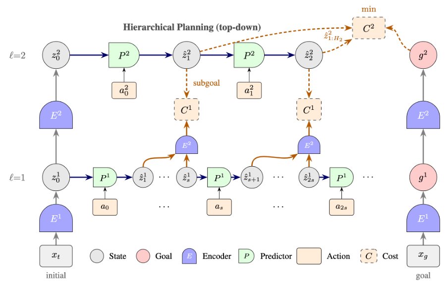

# Hierarchical Action-Conditioned Video JEPA

<p align="center">
  
</p>

**Top-down hierarchical planning (2-level example, $L = 2$).** Given a current observation $x_t$ (left) and a goal observation $x_g$ (right), both are encoded bottom-up through levels 1 and 2, producing initial states $z_0^1, z_0^2$ and goal representations $g^1, g^2$. Planning proceeds top-down: level 2 plans towards $g^2$ by unrolling predictor $P^2$; predicted states $\hat{z}_i^2$ become subgoals for level 1. At each level $\ell$, an optional cost module $C^\ell$ evaluates the predicted trajectory against the corresponding goal or subgoal from level $\ell+1$; at level 1 the predicted states are first re-encoded via $E^2$ before comparison with the level-2 subgoal (Eq. 13). Level 1 plans with raw actions and returns the executable action sequence $a_{0:H_1-1}$.

## Intro

Hierarchical JEPA extends the standard action-conditioned JEPA by introducing L encoder/predictor levels at different temporal scales. Each level ℓ has a **separate neural network encoder** $E^\ell$, a predictor $P^\ell$, and (for $\ell > 1$) a learned action encoder $A^\ell$.

**Level 0 convention**: The groundtruth environment dynamics $s_{t+1} = f(s_t, a_t)$ are abstractly referred to as "level 0", though not implemented in the model.

**Supported datasets**: Two Rooms and DROID. PushT and PointMaze are supported by the flat `ac_video_jepa` example but have not yet been tested with hierarchical planning.

## Architecture

### Temporal Stride

Each level $\ell > 1$ has a **temporal stride** $s(\ell)$ that determines the temporal downsampling factor from level $\ell-1$ to level $\ell$. This is a key architecture hyperparameter that controls the temporal scale at which each level operates. For example, with $s(2) = 4$ and $s(3) = 2$:
- Level 2 operates at 1/4 the temporal resolution of level 1
- Level 3 operates at 1/2 the temporal resolution of level 2 (1/8 of level 1)

### L-Level Hierarchy

| Level | Encoder | Predictor | Actions | Role |
|-------|---------|-----------|---------|------|
| 0 (env) | $f$ (groundtruth) | $f$ | Raw actions $a_t \in \mathcal{A}$ | True environment dynamics (not implemented) |
| 1 (finest) | $E^1$ (e.g. Impala CNN) from observations | $P^1$ (1-step) | Raw actions $a_t \in \mathcal{A}$ | Fine-grained single-step transitions |
| $\ell > 1$ | $E^\ell$ (MLP) from strided $z^{\ell-1}$ | $P^\ell$ ($s(\ell)$-step) | Encoded macro-actions via $A^\ell$ | Abstract, temporally extended dynamics |
| L (coarsest) | $E^L$ | $P^L$ ($s(L)$-step) | Encoded macro-actions via $A^L$ | Plans towards final goal |

### Mathematical Formalization

**Level 1 encoding**:
$$z^1_t = E^1(x_t)$$

**Level $\ell > 1$ encoding**:
$$z^\ell_t = E^\ell(z^{\ell-1}_{s(\ell) \cdot t})$$

**Level 1 prediction**:
$$\hat{z}^1_{t+1} = P^1(\hat{z}^1_t, a_t)$$

**Level $\ell > 1$ prediction**:
$$a^\ell_t = A^\ell(a^{\ell-1}_{t \cdot s(\ell) : (t+1) \cdot s(\ell)})$$
$$\hat{z}^\ell_{t+1} = P^\ell(\hat{z}^\ell_t, a^\ell_t)$$

## Training (Bottom-Up)

Training is driven by `HierarchicalJEPA.unroll()`, which processes the hierarchy **bottom-up**:

1. **Bottom-up state encoding** via `encode_hierarchical()`:
   - Level 1: $z^1 = E^1(\text{observations})$
   - Level $\ell > 1$: $z^\ell = E^\ell(z^{\ell-1}_{::s(\ell)})$ (strided subsampling with stride $s(\ell)$)
2. **Action aggregation** via `aggregate_actions()`:
   - Level 1: raw actions with last action dropped ($T$ states $\to$ $T-1$ transitions)
   - Level $\ell > 1$: learned action encoder $A^\ell$ aggregates stride-sized windows
3. **Per-level unrolling** via `_unroll_at_level()`:
   - Each level's predictor $P^\ell$ unrolls autoregressively or in parallel
   - Prediction loss + regularization computed per level
4. **Loss aggregation**: weighted sum across all levels

**Key function**: `HierarchicalJEPA.unroll(observations, actions, ...)` in `eb_jepa/h_jepa.py`

### Training Objectives

$$\mathcal{L} = \sum_{\ell=1}^{L} w_\ell \cdot \left( \mathcal{L}^\ell_{\text{pred}} + \beta^\ell \mathcal{L}^\ell_{\text{cov}} + \alpha^\ell \mathcal{L}^\ell_{\text{var}} + \delta^\ell \mathcal{L}^\ell_{\text{time-sim}} + \omega^\ell \mathcal{L}^\ell_{\text{IDM}} \right)$$

The IDM loss at level 1 prevents representation collapse from spurious correlations (Sobal et al. 2022).

### Per-Patch Regularization

When the encoder produces a spatially-structured representation (e.g., using all ViT patch tokens instead of a single CLS token), the output at each timestep is a grid of feature vectors rather than a single vector:

$$z^\ell_t \in \mathbb{R}^{D \times H' \times W'}$$

where $H' \times W'$ is the spatial grid size (e.g., $14 \times 14$ for a ViT with patch size 16 on $224 \times 224$ images). We denote $z^\ell_t(i,j) \in \mathbb{R}^D$ the feature vector at spatial position $(i,j)$.

In the standard (non-spatial) setting, regularization losses ($\mathcal{L}_{\text{var}}$, $\mathcal{L}_{\text{cov}}$, or $\mathcal{L}_{\text{SIGReg}}$) are computed on a matrix obtained by flattening all spatial positions into the feature dimension, giving each sample a dimension of $D \cdot H' \cdot W'$. This couples the statistics of all patches.

With `reg_per_patch`, the regularizer is instead applied **independently at each spatial position** $(i,j)$, then averaged over the grid. For a generic regularization loss $\mathcal{R}$:

$$\mathcal{L}_{\text{reg}} = \frac{1}{H' W'} \sum_{i=1}^{H'} \sum_{j=1}^{W'} \mathcal{R}\!\left(\left\{ z^\ell_t(i,j) \right\}_{(b,t) \in \mathcal{B} \times [T]} \right)$$

where $\mathcal{B}$ denotes the batch and $\mathcal{R}$ operates on the set of $|\mathcal{B}| \cdot T$ vectors in $\mathbb{R}^D$ collected at position $(i,j)$ across batch elements and timesteps.

Concretely, $\mathcal{R}$ can be either:

- **VCReg**: $\mathcal{R} = \alpha \cdot \mathcal{L}_{\text{var}} + \beta \cdot \mathcal{L}_{\text{cov}}$, where variance and covariance statistics are computed on the $D$-dimensional features at each patch position independently.
- **SIGReg**: $\mathcal{R} = \gamma \cdot \mathcal{L}_{\text{SIGReg}}$, where the Epps-Pulley Gaussianity statistic is computed on the $D$-dimensional features at each patch position independently, using shared random projections across positions.

This ensures that each spatial position independently maintains well-conditioned feature statistics (non-collapsed variance, decorrelated dimensions), without assuming that features at different spatial positions share the same distribution.

### Action-State Temporal Alignment

- **Level 1**: $T$ states, $T-1$ actions (last action dropped since $s_T$ is outside the sequence)
- **Level $\ell > 1$**: $T_\ell$ states from strided subsampling, $T_\ell - 1$ macro-actions from `aggregate_actions()`

Only at level 1 is the last action discarded. At higher levels, action downsampling naturally produces $T_\ell - 1$ macro-actions for $T_\ell$ states.

## Planning (Top-Down)

Planning proceeds **top-down** via `HierarchicalPlanner.plan()`:

1. **Encode goal** at all levels via `encode_hierarchical(goal_obs)`
2. **Level $L$** (coarsest): plan towards $g^L$ using `level_planners[L].plan()`
   $$a^{L}_{0:H_L-1,*} = \arg\min_{a^{L}_{0:H_L-1}} C^L(\hat{z}^L_{1:H_L}, g^L)$$
   where the cost $C^L$ evaluates the sequence of predicted states against the goal.
3. **Level $\ell < L$** (finer): extract subgoals from level $\ell+1$ trajectory, plan towards them
   - Subgoals: $g^\ell_i := \hat{z}^{\ell+1}_i$ for $i = 1, \ldots, H_{\ell+1}$
   - For each subgoal segment $i$:
   $$a^{\ell}_{0:H_\ell-1,*,(i)} = \arg\min_{a^{\ell}_{0:H_\ell-1}} C^\ell(E^\ell(\hat{z}^\ell_{1:H_\ell}), g^\ell_{i+1})$$
   where $E^\ell(\hat{z}^\ell_{1:H_\ell})$ encodes the intermediate predicted states to level $\ell+1$ for comparison with the subgoal.
4. **Level 1**: plan with raw actions $\to$ return executable actions

**Key classes/functions**:
- `HierarchicalPlanner.plan()` in `eb_jepa/planning/optimizers.py`: top-down loop
- `HierarchicalObjective` in `eb_jepa/planning/objectives.py`: level-aware cost
- `GCAgent._create_hierarchical_planner()` in `eb_jepa/planning/agent.py`: wiring

### Alternative: Action-Based Planning Cost

Instead of encoding intermediate states $\hat{z}^\ell_{1:H_\ell}$ to level $\ell+1$ and comparing with state subgoals, we can define the planning cost at level $\ell$ using **action consistency**:

$$a^{\ell}_{0:H_\ell-1,*,(i)} = \arg\min_{a^{\ell}_{0:H_\ell-1}} C^{\ell}_{\text{action}}\left(\left\{A^{\ell}\left(a^{\ell}_{t \cdot s(\ell) : (t+1) \cdot s(\ell)}\right)\right\}_{t=0}^{H_{\ell+1}-1}, \left\{a^{\ell+1,(i)}_{*,t}\right\}_{t=0}^{H_{\ell+1}-1}\right)$$

where:
- $C^{\ell}_{\text{action}}$ is a cost function in action space (e.g., $\ell_2$ distance)
- $\left\{A^{\ell}\left(a^{\ell}_{t \cdot s(\ell) : (t+1) \cdot s(\ell)}\right)\right\}_{t=0}^{H_{\ell+1}-1}$ are the actions from level $\ell$ aggregated to level $\ell+1$ resolution
- $\left\{a^{\ell+1,(i)}_{*,t}\right\}_{t=0}^{H_{\ell+1}-1}$ are the optimal actions obtained from planning at level $\ell+1$ for segment $i$

This formulation enforces that the lower-level actions, when aggregated, should match the higher-level planned actions.

### Planning Algorithm

```
1. Encode goal state at all L levels: {g^1, g^2, ..., g^L}
   - Level ℓ goal states are computed by hierarchical encoding
   - Each level operates at temporal resolution determined by stride s(ℓ)

2. At level L (coarsest):
   - Plan towards g^L using encoded actions (temporally aggregated via A^L)
   - Obtain trajectory ẑ^L = {ẑ^L_0, ..., ẑ^L_{H_L}} and actions a^L_{0:H_L-1,*}

3. For ℓ = L-1 down to 1:
   - Extract subgoals from ẑ^{ℓ+1}: g^ℓ_i = ẑ^{ℓ+1}_i for i = 1, ..., H_{ℓ+1}
   - Plan at level ℓ: minimize planning cost to reach subgoals
   - If ℓ > 1: use encoded actions (aggregated via action encoder A^ℓ)
   - If ℓ = 1: use raw actions (no aggregation)
   - Obtain trajectory ẑ^ℓ = {ẑ^ℓ_0, ..., ẑ^ℓ_{H_ℓ}} and actions a^ℓ_{0:H_ℓ-1,*}

4. Return raw actions a^1_{0:H_1-1,*} from level-1 planning for execution
```

**Key insight**: Temporal stride $s(\ell)$ determines the temporal scale at each level through both state subsampling and action aggregation.

### Subgoal Modes

- **Single** (receding horizon): only plan towards $g^\ell_1 = \hat{z}^{\ell+1}_1$, re-plan at next step
- **Sequential**: plan through all subgoals $g^\ell_1, \ldots, g^\ell_{H_{\ell+1}}$

### Choosing the Planning Start Level

By default, planning starts from the coarsest level $L$ and refines top-down to level 1. The `start_level` config option allows starting planning from an intermediate level $\ell \leq L$ instead. When `start_level: ℓ`, the procedure is the same as starting from $L$ but treating $g^\ell$ as the highest-level goal:

1. **Level $\ell$** (start level): plan towards $g^\ell$ using `level_planners[ℓ].plan()`
   $$a^{\ell}_{0:H_\ell-1,*} = \arg\min_{a^{\ell}_{0:H_\ell-1}} C^\ell(\hat{z}^\ell_{1:H_\ell}, g^\ell)$$
2. **Levels $\ell-1$ down to 1**: refine with subgoals extracted from the level above, exactly as in the standard top-down procedure.
3. **Level 1**: return executable actions.

Levels above $\ell$ (i.e., $\ell+1, \ldots, L$) are unused during planning. Only `level_configs` for levels $1$ through $\ell$ need to be specified.

This is useful for ablating the contribution of each hierarchy level. Example config:
- `cfgs/planning/lvl2_mppi_ni5_ns50_ne10.yaml`: start from level 2 (`start_level: 2`)

## Backwards Compatibility

Modifications to shared code (`eb_jepa/losses/`, `eb_jepa/planning/agent.py`, `eb_jepa/planning/objectives.py`, `eb_jepa/planning/optimizers.py`) are additive:
- New classes (`HierarchicalObjective`, `HierarchicalPlanner`, `H_PlanningResult`) are added alongside existing ones
- `GCAgent` dispatches to hierarchical vs. flat planning based on `plan_cfg.planner.type`
- Existing `ReprDistObjective`, `ProjectedDistObjective`, `CEMPlanner`, `MPPIPlanner` are unchanged

## Configuration

### Training (`cfgs/train/two_rooms/vc.yaml`)

```yaml
model:
  compile: true
  num_levels: 3  # L = 3 hierarchy levels (Level 1, 2, 3)
  rollout:
    nsteps: 8
    val_nsteps: 8

  # Level 1 (finest): neural network encoder E^1, raw actions
  level_1:
    encoder:
      architecture: impala           # E^1: CNN encoder from observations
      stack_sizes: [16, 32, 32]
      output_dim: 512
    predictor:
      type: rnn
      num_layers: 1
    regularizer:
      cov_coeff: 8
      std_coeff: 8
      sim_coeff_t: 12
      idm_coeff: 1                   # IDM loss to prevent collapse (recommended)
    # No action_encoder - uses raw actions

  # Level 2: temporal stride 2 from level 1, encoded actions
  level_2:
    temporal_stride: 2
    encoder:
      architecture: mlp              # E^2: MLP encoder from pooled z^1
      hidden_dims: [512, 256]
      output_dim: 256
    predictor:
      type: rnn
      num_layers: 1
    action_encoder:                  # A^2: learned aggregation of action windows
      hidden_dims: [64]
      output_dim: 4
      final_ln: true
    regularizer:
      cov_coeff: 4
      std_coeff: 8
      sim_coeff_t: 6
      idm_coeff: 0.5
      action_std_coeff: 4.0
      action_cov_coeff: 2.0

  # Level 3 (coarsest): temporal stride 2 from level 2, encoded actions
  level_3:
    temporal_stride: 2
    encoder:
      architecture: mlp              # E^3: MLP encoder from pooled z^2
      hidden_dims: [256, 128]
      output_dim: 128
    predictor:
      type: rnn
      num_layers: 1
    action_encoder:                  # A^3: learned aggregation of action windows
      hidden_dims: [32]
      output_dim: 8
      final_ln: true
    regularizer:
      cov_coeff: 2
      std_coeff: 4
      sim_coeff_t: 3
      idm_coeff: 0.25
      action_std_coeff: 2.0
      action_cov_coeff: 1.0

optim:
  lr_scales:
    level_2: 1.0
    level_3: 1.0
```

### Planning (`cfgs/planning/lvl2_mppi_ni5_ns50_ne10.yaml`)

```yaml
planner:
  type: hierarchical
  base_planner: mppi
  subgoal_mode: single  # 'single' (receding horizon) or 'sequential'
  start_level: 2
  num_act_stepped: 2    # temporal stride of level 2

  level_configs:
    level_1_planner:     # Finest level (stride=1, produces executable actions)
      plan_length: 12
      n_iters: 5
      num_samples: 50
      num_elites: 10
    level_2_planner:     # Coarsest level (stride=2 relative to Level 1)
      plan_length: 60
      n_iters: 5
      num_samples: 50
      num_elites: 10
      latent_action_stats_path: level_2_action_stats.pt

  # Global planner parameters
  max_norms: [2.45]
  max_norm_dims: [[0, 1]]
  var_scale: 1.5
  max_std: 2.0
  temperature: 0.005

  planning_objective:
    objective_type: hierarchical_repr_dist
    distance: l2
    sum_all_diffs: false
    subgoal_weight: 1.0
    goal_weight: 1.0
```

## Results (Two Rooms)

| Regularizer | Planning | Start Level | SR (%) | Time/ep (s) | Config |
|-------------|----------|-------------|--------|-------------|--------|
| VCReg | Low | 2 | 95.0 ± 5.0 | 11.4 | `vc.yaml` |
| SIGReg | Low | 2 | 93.3 ± 2.9 | 11.6 | `sigreg.yaml` |

**Notes:**
- All models use the Impala-RNN (L1) + MLP (L2/L3) architecture with 3 levels and level_weights=[1,1,1]
- Planning uses 2-level hierarchical MPPI (start_level=2, `lvl2_mppi_ni5_ns50_ne10`)
- High-compute planning configs did not outperform low-compute for VC (pareto front saturates)
- SIGReg high-compute planning needs a dedicated planning sweep on the SIGReg model

## Usage

### Training

```bash
# Train on Two Rooms (default)
python -m examples.h_ac_video_jepa.main \
  --fname examples/h_ac_video_jepa/cfgs/train/two_rooms/vc.yaml

# Train on DROID

# Train on DROID (requires EBJEPA_DATA or EBJEPA_DSETS set)
python -m examples.h_ac_video_jepa.main \
  --fname examples/h_ac_video_jepa/cfgs/train/droid/2lvl_vits16_patch384_lewm.yaml

# Launch with SLURM (3 seeds)
python -m examples.launch_sbatch --example h_ac_video_jepa \
  --fname examples/h_ac_video_jepa/cfgs/train/two_rooms/vc.yaml
```

### Evaluation

```bash
# Run planning evaluation
python -m examples.h_ac_video_jepa.main \
  --meta.model_folder /path/to/trained/model \
  --meta.eval_only_mode True
```

## Key Differences from AC-Video-JEPA

| Aspect | AC-Video-JEPA | H-AC-Video-JEPA |
|--------|---------------|-----------------|
| Temporal Scales | Single | Multiple (L levels) |
| Encoders | 1 encoder | L encoders (E^1, ..., E^L) |
| Action Encoders | None | A^2, ..., A^L for levels > 1 |
| Predictors | 1 predictor | L predictors |
| Action Space | Raw actions only | Raw (level 1) + encoded (levels 2+) |
| IDM Loss | Single IDM | IDM per level (especially important at level 1) |
| Planning | Flat optimization | Top-down hierarchical |
| Long-horizon | Limited by prediction error | Improved via abstraction |

## Files

```
examples/h_ac_video_jepa/
├── README.md           # This file
├── main.py             # Training entrypoint
├── cfgs/
│   ├── train/
│   │   ├── two_rooms/
│   │   │   ├── vc.yaml                 # Default Two Rooms training config (VCReg)
│   │   │   └── sigreg.yaml             # SIGReg regularizer variant
│   │   └── droid/
│   │       ├── 2lvl_vits16_patch384_lewm.yaml
│   │       ├── 2lvl_vits16_patch32_pred384_lewm.yaml
│   │       └── 3lvl_resnet16x16_convgru.yaml  # WIP: alternative architecture, not validated
│   ├── planning/
│   │   ├── lvl2_mppi_ni5_ns50_ne10.yaml # Two Rooms level-2 planning
│   │   └── droid_lvl2_mppi.yaml        # DROID level-2 planning
│   └── eval/
│       ├── two_rooms.yaml              # Two Rooms evaluation settings
│       └── franka_custom.yaml          # Franka custom evaluation settings
```

## References

- [A Path Towards Autonomous Machine Intelligence](https://openreview.net/pdf?id=BZ5a1r-kVsf) - JEPA framework
- [PLDM and Two-Rooms Environment](https://arxiv.org/abs/2502.14819)
